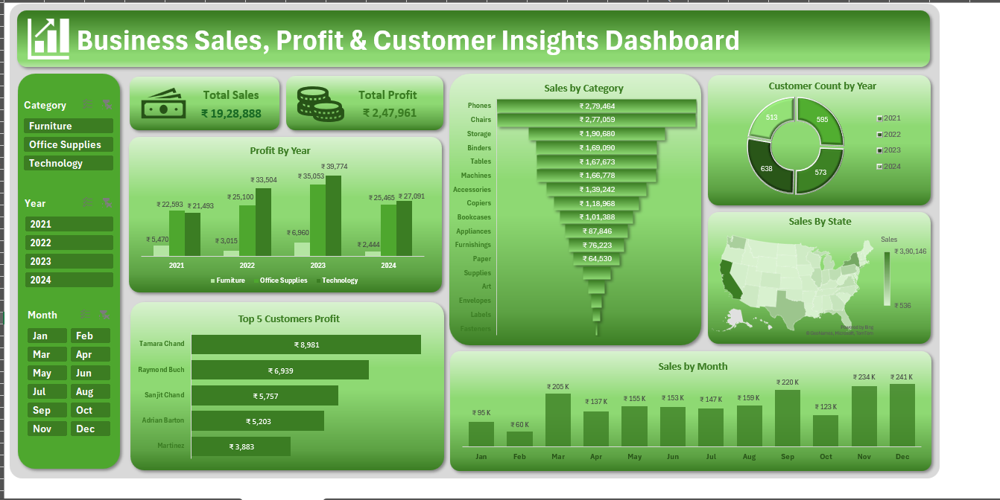

# Business-Sales-Profit-Customer-Insights-Dashboard
## 📌 Overview

Developed an interactive Business Sales & Profit Dashboard in Microsoft Excel to analyze sales performance, profitability, customer insights, and regional trends. The dashboard provides dynamic filtering and visual reports to support data-driven business decisions.

---

## 📷 Dashboard Preview

---

## ✨ Features

- Interactive dashboard with KPI cards for Total Sales and Total Profit
- Pivot Tables and Pivot Charts for dynamic reporting
- Slicers for filtering by Category, Year, and Month
- Sales analysis by Category, Customer, State, Month, and Year
- State-wise sales visualization using a Map Chart

---

## 🛠 Tools Used

- Microsoft Excel
- Pivot Tables
- Pivot Charts
- Slicers
- Data Cleaning
- Data Visualization

---

## 📈 Key Insights

- Identified top-performing product categories.
- Analyzed monthly and yearly sales trends.
- Compared regional sales performance.
- Identified high-value customers.

---

## 📂 Files Included

- Sales and Profit Dashboard Data.xlsx
- Dashboard.png
- README.md

---

## 🚀 Skills Demonstrated

- Excel Dashboard Development
- Data Analysis
- Data Cleaning
- Business Intelligence
- Data Visualization
- Reporting
